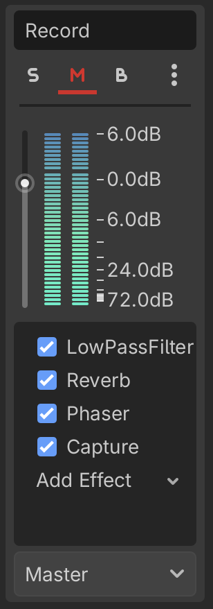
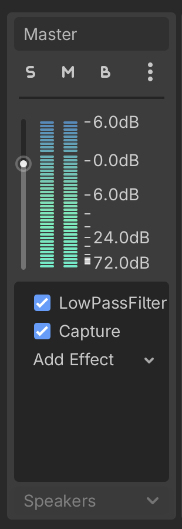
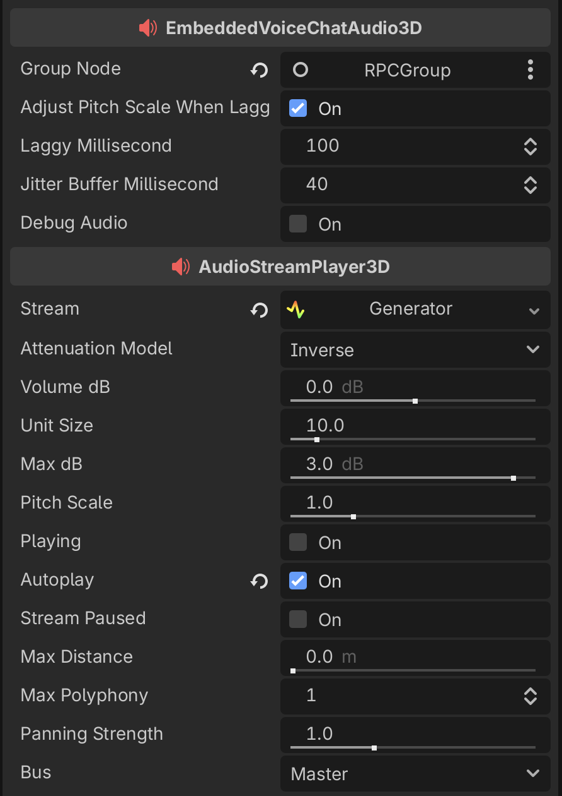

# Godot Example project for Voice Chat Addon and aws Cognito / GameLift for Godot Addon

### Install Plugin

create an `addons` folder and add the `embedded_voice_chat`, `aws_core`, `aws_cognito`, `aws_gamelift`, `amazon_game_lift_server` plugin folder inside it. 

### Example Project

The main scene is `scenes/main.tscn `. It works as a root. Level scenes will be loaded in `$Level` and `$MultiplayerSpawner` will sync the level scenes to clients.

If it's a dedicated server build, it will try to `create_server` from `SERVER_PORT` to `SERVER_PORT_MAX` or `65535` until it finds a valid listen port:
```gdscript
func start_server(port: int = SERVER_PORT) -> bool:
	var peer: ENetMultiplayerPeer = ENetMultiplayerPeer.new()
	var error: Error = peer.create_server(port, MAX_CLIENT)
	if error:
		if error == ERR_ALREADY_IN_USE:
			notification.emit(NotificationLevel.Warning, "peer is already in use")
			return false
		elif error == ERR_CANT_CREATE:
			if port >= SERVER_PORT_MAX or port > 65535:
				notification.emit(NotificationLevel.Error, "port from %d to %d are already in use" % [SERVER_PORT, SERVER_PORT_MAX])
				return false
			notification.emit(NotificationLevel.Warning, "failed to open port %d, trying %d" % [port, port + 1])
			return start_server(port + 1)
		notification.emit(NotificationLevel.Warning, "faled to create server: %d" % error)
		return false
	
	notification.emit(NotificationLevel.Log, "server is listening on port %d" % port)
	server_port = port
	multiplayer
```

If it found a valid listen port, it will call `init_sdk`, `instantiate` the default server map, and call `process_ready`.

```gdscript
func initialize_server():
	var sdk_version_result: AmazonGameLiftServer_GetSdkVersionResult = AmazonGameLiftServer_GetSdkVersionResult.new()
	sdk_version_result.sdk_version = ""
	var get_sdk_version_outcome: AmazonGameLiftServer_Outcome = AmazonGameLiftServer_Outcome.new();
	get_sdk_version_outcome.success = false
	AmazonGameLiftServer_GameLiftServerAPI.get_sdk_version(sdk_version_result, get_sdk_version_outcome)
	
	if not get_sdk_version_outcome.success:
		notification.emit(NotificationLevel.Error, "get sdk version failed: %s" % get_sdk_version_outcome.error_message)
	else:
		notification.emit(NotificationLevel.Log, "sdk version: %s" % sdk_version_result.sdk_version)
		
	var server_parameters: AmazonGameLiftServer_ServerParameters = AmazonGameLiftServer_ServerParameters.new()
	server_parameters.auth_token = game_server_auth_token
	server_parameters.aws_region = game_server_region
	server_parameters.fleet_id = game_server_fleet_id
	server_parameters.host_id = game_server_host_id
	server_parameters.process_id = str(OS.get_process_id())
	server_parameters.web_socket_url = game_server_web_socket_url
	
	var init_sdk_outcome: AmazonGameLiftServer_Outcome = AmazonGameLiftServer_Outcome.new();
	AmazonGameLiftServer_GameLiftServerAPI.init_sdk(server_parameters, init_sdk_outcome)
	
	if not init_sdk_outcome.success:
		notification.emit(NotificationLevel.Error, "init sdk failed: %s" % init_sdk_outcome.error_message)
		return
	
	if default_server_map.can_instantiate():
		server_level = default_server_map.instantiate()
		$Level.add_child(server_level)
	
	process_parameter = AmazonGameLiftServerProcessParameter.new()
	process_parameter.port = server_port
	if AmazonGameLiftServerCustomLogger.log_path:
		process_parameter.log_paths = [
			ProjectSettings.globalize_path(AmazonGameLiftServerCustomLogger.log_path)
		]
	else:
		process_parameter.log_paths = []
	process_parameter.on_process_parameter_start_game_session.connect(on_start_game_session)
	process_parameter.on_process_parameter_update_game_session.connect(on_update_game_session)
	process_parameter.on_process_parameter_process_terminate.connect(on_process_terminate)
	
	var process_ready_outcome: AmazonGameLiftServer_Outcome = AmazonGameLiftServer_Outcome.new();
	AmazonGameLiftServer_GameLiftServerAPI.process_ready(process_parameter, process_ready_outcome)
	
	if not process_ready_outcome.success:
		notification.emit(NotificationLevel.Error, "process ready failed: %s" % process_ready_outcome.error_message)
		return
```

If it's a client build, it will instantiate the default client map.
```gdscript
func initialize_client():
	if default_client_map.can_instantiate():
		client_level = default_client_map.instantiate()
		$Level.add_child(client_level)
```

The default client map is `scenes/user_login.tscn`. It's a UI scene for login, signup, forget password based on Cognito for Godot Addon.

Once the player logged in, the `auth_result` will contain access token, refresh token and id token. The `main.gd` will use the `auth_result` to retrieve `credentials` for GameLift for Godot Addon to create game session, player session on the gamelift fleet. The `user_login` scene will be queue_free and connect to the dedicated server.

```gdscript
func get_credentials_for_clients() -> AWSSDKCore_Auth_AWSCredentials:
	if (
		cognito_region.is_empty() 
		or not cognito_identity_clients.has(cognito_region)
	):
		notification.emit(NotificationLevel.Error, "Can't find cognito identity client object for region: %s" % cognito_region)
		return null
		
	var cognito_identity_client: CognitoIdentityClient = cognito_identity_clients[cognito_region]
	
	if (cognito_identity_client == null):
		notification.emit(NotificationLevel.Error, "Cognito identity client object for region: %s is not initiated" % cognito_region)
		return null
	
	logins = {
		"cognito-idp.{cognito_region}.amazonaws.com/{cognito_user_pool_id}".format({
			"cognito_region": cognito_region,
			"cognito_user_pool_id": cognito_user_pool_id,
		}): auth_result.id_token,
	}
	
	var identity_id: String
#	dummy scope
	if true:
		var request: AWSSDKCognitoIdentity_Model_GetIdRequest = AWSSDKCognitoIdentity_Model_GetIdRequest.new()
		request.identity_pool_id = cognito_identity_pool_id
		request.logins = logins
		var response_receive_handler: AWSSDKCognitoIdentity_Model_GetIdResponseReceivedHandler = cognito_identity_client.get_id(request)
		
		if response_receive_handler == null:
			notification.emit(NotificationLevel.Error, "cognito identity client is not init properly.")
			return null
		
		var outcome: AWSSDKCognitoIdentity_Model_GetIdOutcome = await response_receive_handler.complete
		
		if !outcome.success or outcome.result == null:
			notification.emit(NotificationLevel.Error, outcome.error_message)
			return null
			
		identity_id = outcome.result.identity_id
	
	var credetials: AWSSDKCore_Auth_AWSCredentials = null
#	dummy scope
	if true:
		var request: AWSSDKCognitoIdentity_Model_GetCredentialsForIdentityRequest = AWSSDKCognitoIdentity_Model_GetCredentialsForIdentityRequest.new()
		request.identity_id = identity_id
		request.logins = logins
		var response_receive_handler: AWSSDKCognitoIdentity_Model_GetCredentialsForIdentityResponseReceivedHandler = cognito_identity_client.get_credentials_for_identity(request)
		
		if response_receive_handler == null:
			notification.emit(NotificationLevel.Error, "cognito identity client is not init properly.")
			return null
		
		var outcome: AWSSDKCognitoIdentity_Model_GetCredentialsForIdentityOutcome = await response_receive_handler.complete
		
		if !outcome.success or outcome.result == null:
			notification.emit(NotificationLevel.Error, "get credentials for identity error: %d %s" % [outcome.error, outcome.error_message])
			return null
			
		credetials = AWSSDKCore_Auth_AWSCredentials.new()
		credetials.access_key_id = outcome.result.credentials.access_key_id
		credetials.secret_key = outcome.result.credentials.secret_key
		credetials.session_token  = outcome.result.credentials.session_token
		credetials.expiration = outcome.result.credentials.expiration
	
	return credetials
```

```gdscript
func enter_game() -> bool:
	if (
		gamelift_region.is_empty() 
		or not gamelift_clients.has(gamelift_region)
	):
		notification.emit(NotificationLevel.Error, "Can't find gamelift client object for region: %s" % gamelift_region)
		return false
		
	var gamelift_client: GameLiftClient = gamelift_clients[gamelift_region]
	
	if (gamelift_client == null):
		notification.emit(NotificationLevel.Error, "Gamelift client object for region: %s is not initiated" % gamelift_region)
		return false
	
	var game_session_id: String = await get_game_session()
	
	if game_session_id.is_empty():
		return false
		
	var request: AWSSDKGameLift_Model_CreatePlayerSessionRequest = AWSSDKGameLift_Model_CreatePlayerSessionRequest.new()
	request.game_session_id = game_session_id
	request.player_id = username
	var response_receive_handler: AWSSDKGameLift_Model_CreatePlayerSessionResponseReceivedHandler = gamelift_client.create_player_session(request)
		
	if response_receive_handler == null:
		notification.emit(NotificationLevel.Error, "gamelift client is not init properly.")
		return false
	
	var outcome: AWSSDKGameLift_Model_CreatePlayerSessionOutcome = await response_receive_handler.complete
	
	if !outcome.success or outcome.result == null:
		notification.emit(NotificationLevel.Error, outcome.error_message)
		return false
	
	client_level.queue_free()
	if !start_client(outcome.result.player_session.ip_address, outcome.result.player_session.port):
		get_tree().quit()
		return false
	
	return true


func get_game_session() -> String:
	if (
		gamelift_region.is_empty() 
		or not gamelift_clients.has(gamelift_region)
	):
		notification.emit(NotificationLevel.Error, "Can't find gamelift client object for region: %s" % gamelift_region)
		return String()
		
	var gamelift_client: GameLiftClient = gamelift_clients[gamelift_region]
	
	if (gamelift_client == null):
		notification.emit(NotificationLevel.Error, "Gamelift client object for region: %s is not initiated" % gamelift_region)
		return String()
		
	if true:
		var request: AWSSDKGameLift_Model_SearchGameSessionsRequest = AWSSDKGameLift_Model_SearchGameSessionsRequest.new()
		request.alias_id = alias_id
		request.location = location
		request.filter_expression = "hasAvailablePlayerSessions=true"
		var response_receive_handler: AWSSDKGameLift_Model_SearchGameSessionsResponseReceivedHandler = gamelift_client.search_game_sessions(request)
		
		if response_receive_handler == null:
			notification.emit(NotificationLevel.Error, "gamelift client is not init properly.")
			return String()
	
		var outcome: AWSSDKGameLift_Model_SearchGameSessionsOutcome = await response_receive_handler.complete
	
		if !outcome.success or outcome.result == null:
			notification.emit(NotificationLevel.Error, outcome.error_message)
			return String()
			
		if outcome.result.game_sessions.size() > 0:
			return outcome.result.game_sessions[0].game_session_id
			
		print("search game session returns: %d" % outcome.result.game_sessions.size())
	
	var game_session_id: String
	if true:
		var request: AWSSDKGameLift_Model_CreateGameSessionRequest = AWSSDKGameLift_Model_CreateGameSessionRequest.new()
		request.alias_id = alias_id
		request.location = location
		request.maximum_player_session_count = MAX_CLIENT
		var response_receive_handler: AWSSDKGameLift_Model_CreateGameSessionResponseReceivedHandler = gamelift_client.create_game_session(request)
		
		if response_receive_handler == null:
			notification.emit(NotificationLevel.Error, "gamelift client is not init properly.")
			return String()
	
		var outcome: AWSSDKGameLift_Model_CreateGameSessionOutcome = await response_receive_handler.complete
	
		if !outcome.success or outcome.result == null:
			notification.emit(NotificationLevel.Error, "create game session error: %d %s" % [outcome.error, outcome.error_message])
			return String()
			
		game_session_id = outcome.result.game_session.game_session_id
		
	return game_session_id
```

The default server map is `scenes/level.tscn`. Player scene will be loaded in `$Players` and `$MultiplayerSpawner` will sync the Player scenes to clients. Each player will be assigned with a player id which equals his multiplayer unique id.

The default player character is `character/player.tscn`. It will check if the current client owns itself in `_ready`:

```gdscript
func _ready():
	if player_id == -1:
		print("didn't receive player id")
		queue_free()
		return
		
	is_local_player = (player_id == multiplayer.get_unique_id())
```

If current client owns the player character, it will join `Default` voice chat group:

```````gdscript
		$RPCGroup.join_group("Default")
```````

and instantiate audio recorder scene, audio listener scene from EmbeddedVoiceChat plugin.

````gdscript
		audio_recorder = audio_recorder_scene.instantiate()
		audio_recorder.bus = record_bus
		# to debug audio, enable below line, it will generate a pcm file for Post-mortem Debugging
		#audio_recorder.debug_audio = true
		$CollisionShape3D/MeshInstance3D.add_child(audio_recorder)
		audio_listener = audio_listener_3d_scene.instantiate()
		# to debug audio, enable below line, it will generate a pcm file for Post-mortem Debugging
		#audio_listener.debug_audio = true
		$CameraPivot/SpringArm3D/Camera3D.add_child(audio_listener)
		audio_listener.make_current()
````

Audio recorder scene is used to capture audio from `record_bus`, which should contain an Audio Effect Capture. You can add other audio effects on top of Audio Effect Capture to make the player sounds like in a special space.



Audio listener scene is used to capture audio from `Master` bus, which should also contain an Audio Effect Capture. The audio data will be used for echo cancellation system. You can add other audio effects on top of Audio Effect Capture to make the player feels like in a special space.



The player character also contains a `$AudioStreamPlayer3D`, which will be used to play the audio data from `$RPCGroup`. It should use Audio Stream Generator and be attached with a group node. 


